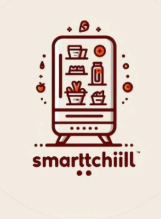

# geladeira-inteligente
 um aplicativo móvel para uma geladeira inteligente, como parte do trabalho da disciplina de back-end da faculdade UNIT no período 24.2.

Principais funcionalidades:

Monitoramento de Estoque: Permite ao usuário verificar os itens disponíveis na geladeira em tempo real, auxiliando no controle de alimentos e evitando desperdícios.
Notificações de Validade: Envia alertas sobre a data de vencimento dos produtos armazenados, garantindo o consumo seguro dos alimentos.
Lista de Compras Automatizada: Sugere itens para reposição com base no consumo habitual e nos produtos em falta, facilitando o planejamento de compras.
Tecnologias utilizadas:

Python: Linguagem principal utilizada para o desenvolvimento do back-end da aplicação, proporcionando robustez e flexibilidade.
Figma: Ferramenta empregada para o design e prototipação da interface do aplicativo móvel, assegurando uma experiência de usuário intuitiva e eficiente. 

link do figma do projeto 
https://www.figma.com/proto/6MjEEhAA70prVOXgXDmaHB/Geladeira-Inteligente?node-id=1-2&t=lj7ljm2M1YsZ2z8b-1&starting-point-node-id=47%3A35
